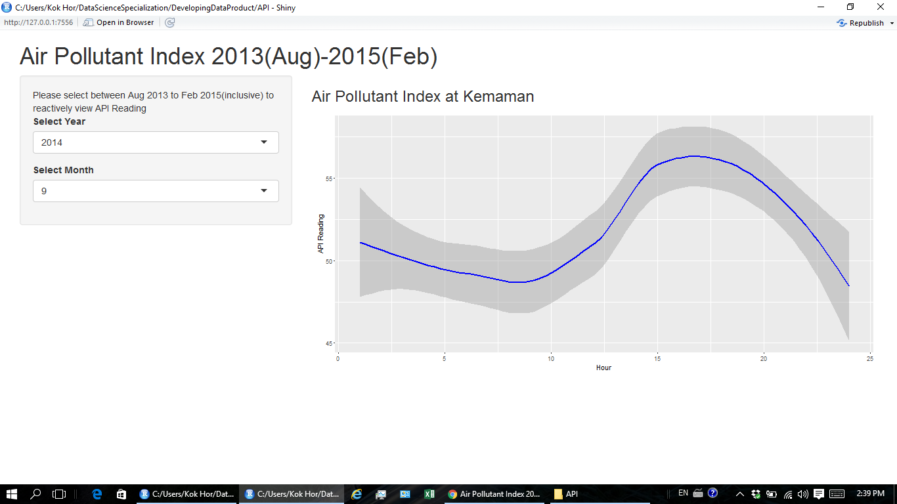

API
========================================================
author: NgKokHor
date: February 6, 2016

Introduction
========================================================

Project - An Application to Reactively View Air Pollutant Index (API) Data

- A typical town in east coast of Malaysia, Kemaman 

- The API capture data by the hour from 01-08-2013 till 05-02-2015

- original unprocessed data can be obtained from http://data.gov.my/view.php?view=280

The Application
========================================================
- A Web Application develop using Shiny

- An Application to plot API reading by Year and Month

- IE or Google Chrome to access https://kokhor.shinyapps.io/APPNAME/


Run the Application
========================================================

- select year and month between 2013 August to 2015 February 

- Reactively view the daily(24 hours) trend of API data


```
  Station.No Location       Date Hour API Pollutant
1         46  Kemaman 2013-08-01    1  66         *
2         46  Kemaman 2013-08-01    2  67         *
3         46  Kemaman 2013-08-01    3  67         *
4         46  Kemaman 2013-08-01    4  67         *
5         46  Kemaman 2013-08-01    5  67         *
6         46  Kemaman 2013-08-01    6  67         *
```

The Sample Output
========================================================




